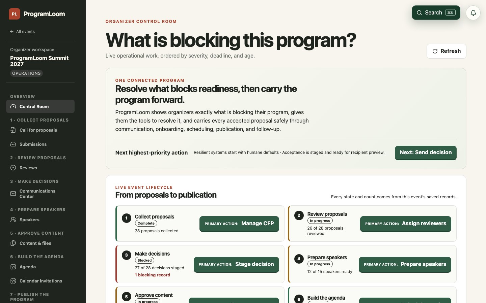

# ProgramLoom

ProgramLoom shows organizers exactly what is blocking their program, gives them the tools to resolve it, and carries every accepted proposal safely through communication, onboarding, scheduling, publication, and follow-up.

The **Control Room** shows what is keeping the program from being ready and takes the organizer directly to the work that resolves it.

- Marketing: [programloom.com](https://programloom.com)
- Application: [app.programloom.com](https://app.programloom.com)
- Help center: [programloom.com/help](https://programloom.com/help/)
- Public CFP directory: [app.programloom.com/cfp](https://app.programloom.com/cfp)
- Live multi-day program: [programloom.com/program](https://programloom.com/program)
- Evaluator entry: [programloom.com/evaluate](https://programloom.com/evaluate)

> **Verified in production:** real Resend delivery ✓ · Gmail + Apple Calendar lifecycle ✓ · Airtable healthy at 0 pending / 0 failed / 0 conflicts ✓ · 77 production browser scenarios ✓ · 237 unit and API tests ✓

## Judge ProgramLoom in the first five minutes

1. **[Watch the 90-second Control Room tour](https://programloom.com/evaluate).** It begins with real persisted blockers and opens their direct resolution paths from the recommended next action.
2. **Open Organizer, Reviewer, Speaker, and Public Program** from the same page. Each card explains its authorization boundary and links to the exact seeded production state.
3. **Use the direct proof routes** there for the published CFP, incomplete review, outstanding speaker work, schedule conflict, retryable communication, and public outputs—no scavenger hunt required.

Three product decisions explain why ProgramLoom is safe to operate:

- **Stage decision ≠ Send decision.** Recording an outcome cannot accidentally email hundreds of speakers.
- **Control Room actions come from persisted facts.** Organizers never maintain a decorative “complete” flag.
- **Calendar updates and cancellations have lifecycle semantics.** Stable UID and increasing sequence prevent stale participant calendars.

## Watch the complete production walkthrough

[](https://github.com/maddiedreese/ProgramLoom/releases/tag/programloom-final-walkthrough-2026-08-12)

**[Play the walkthrough on ProgramLoom](https://programloom.com/#walkthrough)** · [Open the walkthrough evidence](https://github.com/maddiedreese/ProgramLoom/releases/tag/programloom-final-walkthrough-2026-08-12) · [Download the full-quality WebM](https://github.com/maddiedreese/ProgramLoom/releases/download/programloom-final-walkthrough-2026-08-12/programloom-walkthrough.webm) · [Explore the live public program](https://programloom.com/program) · [Choose an evaluator persona](https://programloom.com/evaluate)

The 3:33 walkthrough is silent and uses concise on-screen chapter overlays. It creates a fresh production event and follows one connected proposal through CFP publication, submission, reviewer routing, completed review, staged acceptance, recipient preview, decision delivery, speaker onboarding, uploads, content approval, scheduling, calendar delivery, a real conflict and resolution, agenda publication, all five public widgets, itinerary persistence and export, Command+K, Airtable health, cancellation, and final Control Room reconciliation. Organizer, reviewer, and speaker access use ProgramLoom's normal authorization flow throughout. The only external invitation-delivery wait is visibly labeled and accelerated 8×; the verified temporary event is deleted afterward.

## Judge's fast evaluation path

Everything below is backed by persisted production records rather than browser-only demo state.

1. **Start with the [90-second judge tour](https://programloom.com/evaluate).** It demonstrates the Control Room differentiator before the complete lifecycle.
2. **Open the [controlled evaluator entry](https://programloom.com/evaluate).** Organizer, Reviewer, Speaker, and Attendee cards explain the boundaries of each persona and route through normal authentication or anonymous access.
3. **Inspect [ProgramLoom Summit 2027](https://programloom.com/program).** The polished multi-day production event links its public CFP, agenda, speakers, itinerary, JSON, XML, ICS, and JavaScript embed outputs in one place.
4. **Read the [help center](https://programloom.com/help/).** It documents the complete lifecycle, integrations, recovery paths, search, developer platform, and role-specific workflows.
5. **Review the [sanitized production evidence](docs/evidence/production-manifest.json).** It locks the deployed source and Worker identity, exact test totals, evidence states, public routes, and tested environments.

## Complete capability checklist

### Control Room and lifecycle guidance

- [x] Seven persisted lifecycle stages: Collect proposals, Review proposals, Make decisions, Prepare speakers, Approve content, Build the agenda, and Publish the program.
- [x] Server-derived Not started, In progress, Blocked, and Complete states with the live record count behind each state.
- [x] One deterministic **Recommended next action** showing its label, reason, affected-record count, and direct filtered-workspace link.
- [x] The next three lower-priority actions, stable priority ties, and live recommendation updates as blockers clear.
- [x] Full Control Room plus compact event-page lifecycle guidance, responsive and keyboard accessible.
- [x] Persistent mutation results explain what changed, the durable new state, the recommended next action, and its direct link.

### CFP and proposal collection

- [x] Reusable event templates and duplication with explicit configuration preview.
- [x] Public CFP builder, publication controls, discoverable CFP directory, custom questions, tracks, formats, deadlines, and event timezone.
- [x] Visible section progress and required-items-completed progress.
- [x] Server-equivalent validation before advancing between CFP sections, field-level error associations, and explanatory copy for non-obvious fields.
- [x] A clear post-submission explanation plus saved confirmation and organizer-side proposal discovery.
- [x] Searchable, filterable, configurable submission workspace with saved personal and shared organization views.

### Reviews and decisions

- [x] Multiple review rounds, routing rules, eligible-reviewer assignment, review-readiness views, and explicit **Run routing** and **Assign reviewers** actions.
- [x] Reviewer-only queues and scorecards with complete, incomplete, conflicted, and recused states.
- [x] Blind-review identity protection across API responses, exports, search destinations, logs, analytics, and URLs.
- [x] Acceptance, waitlist, and rejection staging with proposal-level eligibility controls.
- [x] **Stage decision** never sends email; **Send decision** is a separate, explicit Communications action.
- [x] Recipient and rendered-message preview before delivery.

### Communications and reliability

- [x] Queue-backed transactional communication with prepared, queued, processing, sent, delivered, bounced, failed, and cancelled states.
- [x] Idempotent requests and retries prevent duplicate email.
- [x] Monotonic webhook handling prevents late events from downgrading terminal delivery state.
- [x] Visible retry for recoverable failures, cancellation, audit history, notifications, and structured correlation identifiers.
- [x] Resend or Airtable failure remains isolated from unrelated product areas.
- [x] Controlled fictional identities and reserved email aliases; no personal addresses appear on public surfaces.

### Speakers, onboarding, and content

- [x] Acceptance creates or activates the connected speaker and session records.
- [x] Event-scoped speaker invitations and a private speaker portal protected by normal authorization.
- [x] Speaker profiles, biographies, job title, company, persisted headshots, graceful fallbacks, and linked sessions.
- [x] Completed and incomplete onboarding tasks with organizer readiness consequences.
- [x] Content requests, real R2 uploads/downloads, file versions, comments, requested changes, approval, and missing-content states.
- [x] Explicit Close, Back, or Return controls, Escape handling, focus containment, and focus restoration on detail surfaces.

### Agenda and calendar lifecycle

- [x] Rooms, tracks, formats, agenda placements, assisted scheduling, keyboard scheduling alternatives, and conflict-free previews.
- [x] Real room and shared-speaker conflict detection with explicit **Resolve conflict** actions wherever a conflict is shown.
- [x] Draft versus published agenda state and explicit **Publish agenda** action.
- [x] Participant-addressed calendar invitations kept separate from public itinerary ICS.
- [x] Stable calendar UID with increasing sequence across time and room changes.
- [x] Standards-compliant `METHOD:CANCEL`, safe explicit rescheduling after cancellation, participant communication, and public removal.

### Public attendee experience

- [x] Five live widgets: agenda, session directory, speaker directory, speaker gallery, and personal itinerary.
- [x] Current event-local dates and time ranges, rooms, tracks, formats, every attached speaker, biographies, and linked sessions.
- [x] Expandable descriptions, explicit detail Close/Back controls, accurate search/filter counts, and unmistakable selected-day state.
- [x] Itinerary add, reload persistence, removal, and valid ICS export.
- [x] Direct and embedded views stay consistent; configuration changes propagate without regenerating embed code.
- [x] JSON, XML, ICS, HTML, iframe, and JavaScript embed outputs.
- [x] Anonymous responsive behavior across desktop, tablet, and mobile.

### Platform, integrations, and operations

- [x] Organization and event isolation enforced server-side across organizers, reviewers, speakers, anonymous users, and scoped API tokens.
- [x] Search and Command+K across speakers, sessions, files, communications, and safe quick actions.
- [x] Notification center, audit trail, API tokens, OAuth authorization, webhooks, and developer documentation.
- [x] Airtable outbox synchronization, stable external IDs, deduplicated recovery, and visible pending/failed/conflict health.
- [x] PostHog product events without personal data, query text, message bodies, or tokens.
- [x] Cloudflare Workers, D1, R2, Queues, stale-asset 404 protection, asset-version recovery, migrations, and production health identity.
- [x] AGPL-3.0-only source with documented local setup, testing, deployment, architecture, data model, and recovery procedures.

### Quality bar

- [x] WCAG 2.1 AA behavior: keyboard traversal, visible focus, accessible names, dialog containment, Escape, focus restoration, semantic forms/tables, live regions, contrast, reduced motion, zoom, and 320px reflow.
- [x] No color-only status communication and 44×44 CSS-pixel interaction targets on mobile.
- [x] Automated desktop, tablet, and mobile screenshots for primary organizer and public routes.
- [x] Authorization matrix covers anonymous, same-event organizer, cross-organization organizer, cross-event organizer, assigned/unassigned reviewer, connected/unconnected speaker, revoked token, and missing token scope.
- [x] Reliability coverage includes email idempotency, retry deduplication, monotonic webhooks, calendar identity, Airtable recovery, stale assets, and integration isolation.
- [x] Clean-checkout gates: 237/237 unit and API tests, 77 production public browser scenarios, 132 help/crawler scenarios, and 92/92 visual comparisons.
- [x] Zero serious or critical automated accessibility violations, zero high or critical production dependency vulnerabilities, zero committed secrets, and zero broken help links.

## What you can do with ProgramLoom

ProgramLoom keeps one proposal connected through the full event journey:

1. **Collect ideas.** Publish a clear call for proposals with the questions, tracks, and session formats your event needs.
2. **Coordinate reviews.** Route proposals to eligible reviewers, collect consistent scorecards, and monitor unfinished work.
3. **Make careful decisions.** Record an intended acceptance, waitlist, or rejection without emailing anyone yet.
4. **Send the right message.** Preview the real recipients and rendered decision message before it enters the delivery queue.
5. **Prepare speakers.** Invite accepted speakers to a private portal, collect profiles and headshots, and track onboarding tasks.
6. **Collect session content.** Request slides and other files, keep version history and comments, and approve public content.
7. **Build the schedule.** Place sessions into rooms and times, resolve speaker or room conflicts, and keep calendar invitations current.
8. **Publish for attendees.** Share an accessible agenda, session directory, speaker directory, gallery, and personal itinerary.

At every stage, the Control Room turns the event's saved state into an understandable next-action list.

## A safer way to communicate decisions

**Stage decision** and **Send decision** are separate actions.

Staging records what the team intends to do. It sends no message. An organizer then opens **Communications**, checks the recipient list and message preview, and chooses **Send decision** when everything is ready.

## Who ProgramLoom is for

- **Organizers** see the complete event workflow and readiness state.
- **Reviewers** see only the proposals and scorecards assigned to them.
- **Speakers** see their own profile, sessions, tasks, files, resources, and feedback.
- **Attendees** use the public schedule and itinerary without creating an account.

New to the product? Start with [Create your first event](https://programloom.com/help/getting-started), or choose a guide for [organizers](https://programloom.com/help/organizers/control-room), [reviewers](https://programloom.com/help/reviewers), [speakers](https://programloom.com/help/speakers), or [attendees](https://programloom.com/help/attendees).

## Open source and self-hostable

ProgramLoom is licensed under the [GNU Affero General Public License v3.0](LICENSE), and its [source code is available on GitHub](https://github.com/maddiedreese/ProgramLoom). The production application uses Cloudflare Workers, D1, R2, and Queues, with Resend for transactional email and optional Airtable and PostHog connections.

The product is designed so required event workflows use real saved records, real file storage, real background jobs, and server-side permissions. It does not depend on browser-only demo state.

## Run ProgramLoom locally

You need Node.js 22 or newer and a Cloudflare account for the Worker-backed features.

```bash
npm install
cp .env.example .env.local
npm run db:migrate:local
npm run dev
```

The public help center runs separately during documentation editing:

```bash
npm run docs:dev
```

Do not commit environment files, authentication state, private links, provider payloads, or production evidence.

### Environment variables

Start from `.env.example`; it contains names and safe local defaults, never secret values. Configure `APP_BASE_URL`, `APP_DOMAIN`, `EMAIL_FROM`, and `EMAIL_REPLY_TO` for the public application. PostHog and Turnstile public keys are optional client configuration. Keep `SESSION_SECRET`, `ENCRYPTION_KEY`, `DEVELOPER_SECRET_KEY`, Airtable credentials, Resend credentials, and `TURNSTILE_SECRET_KEY` server-only in `.dev.vars` locally or encrypted Worker secrets in production.

## Verify a change

```bash
npm run typecheck
npm run test
npm run build
npm run test:e2e:public
npm run test:e2e:help
```

The complete `npm run check` command also validates the sanitized production-evidence schema. Authenticated browser tests require ignored storage-state and event configuration described in [the contributor runbook](docs/runbook.md).

## Deploy

Apply additive database migrations before deploying the matching source commit:

```bash
npm run check
npm run db:migrate:remote
RELEASE_COMMIT="$(git rev-parse HEAD)" npm run deploy
```

After deployment, verify production health, authenticated desktop and mobile workflows, public views, message and integration queues, and the exact deployed source identity.

## Technical reference

- [Architecture](docs/architecture.md)
- [Data model](docs/data-model.md)
- [Airtable synchronization](docs/airtable.md)
- [Developer platform](docs/developer-platform.md)
- [Operations and recovery](docs/runbook.md)
- [Capability map](docs/parity-map.md)

## License

Copyright 2026 ProgramLoom contributors. Licensed under the [GNU Affero General Public License v3.0 only](LICENSE).
