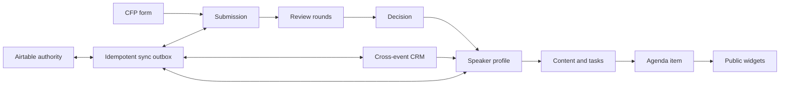

# Data model

The initial migration deliberately models the complete product lifecycle so later modules share identities and handoffs instead of duplicating records.

Organization and event IDs are carried through every sensitive record. Queries must begin from a verified membership scope. Public views are generated from approved read models rather than exposing organizer tables.
