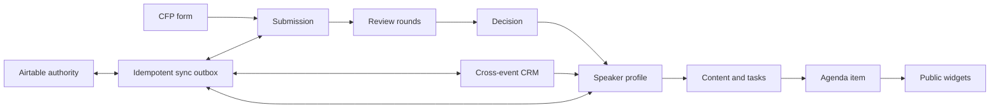

# Data model

The initial migration deliberately models the complete product lifecycle so later modules share identities and handoffs instead of duplicating records.

Organization and event IDs are carried through every sensitive record. Queries must begin from a verified membership scope. Public views are generated from approved read models rather than exposing organizer tables.

# Reusable event configuration

`event_program_settings` stores event-scoped routing, reminder, format/location, content-workflow, and CRM handoff defaults that do not belong to operational history. `event_templates` stores a versioned organization-scoped configuration snapshot and source provenance. `event_creation_operations` is the recoverable creation ledger; `events.source_event_id`, `source_template_id`, and `creation_operation_id` preserve how a draft was made without reusing external identifiers.

Template materialization regenerates all copied IDs and never reads from submission, review, speaker/contact, file, communication-history, calendar, audit, external-record, or credential tables.

# Organizer search

`search_recent_destinations` stores only a user ID, tenant scope, entity type/ID, and access timestamp. It never stores search text, record labels, message content, or private fields. Source tables remain authoritative; recent rows are authorization-revalidated, cascade with deleted users/organizations/events, and are pruned to the newest twenty records per user. Migration `0017_organizer_search.sql` adds compound tenant/name/time indexes to the participating domain tables so search requests never require an unbounded table response.
