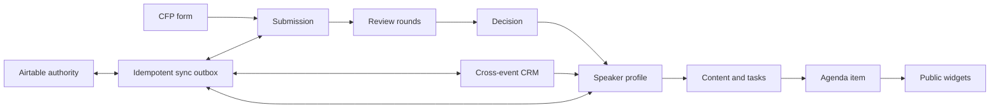

# Data model

The initial migration deliberately models the complete product lifecycle so later modules share identities and handoffs instead of duplicating records.

Organization and event IDs are carried through every sensitive record. Queries must begin from a verified membership scope. Public views are generated from approved read models rather than exposing organizer tables.

# Reusable event configuration

`event_program_settings` stores event-scoped routing, reminder, format/location, content-workflow, and CRM handoff defaults that do not belong to operational history. `event_templates` stores a versioned organization-scoped configuration snapshot and source provenance. `event_creation_operations` is the recoverable creation ledger; `events.source_event_id`, `source_template_id`, and `creation_operation_id` preserve how a draft was made without reusing external identifiers.

Template materialization regenerates all copied IDs and never reads from submission, review, speaker/contact, file, communication-history, calendar, audit, external-record, or credential tables.

# Organizer search

`search_recent_destinations` stores only a user ID, tenant scope, entity type/ID, and access timestamp. It never stores search text, record labels, message content, or private fields. Source tables remain authoritative; recent rows are authorization-revalidated, cascade with deleted users/organizations/events, and are pruned to the newest twenty records per user. Migration `0017_organizer_search.sql` adds compound tenant/name/time indexes to the participating domain tables so search requests never require an unbounded table response.

# Notification center

`notifications` stores the authorized recipient, tenant/event scope, fixed category/type, severity, user-facing summary, relative action URL, optional source identity, coalescing key, occurrence timestamps/count, read state, archive state, and expiry. `notification_preferences` stores per-user category choices at organization or event scope. `notification_channel_deliveries` links an opt-in email channel to its real `communication_messages` record and retains prepared/queued/sent/failed state and attempts.

Notification rows and preferences intentionally do not synchronize to Airtable. They are user-specific application operations; event/submission/speaker/file business records remain authoritative in their existing D1/Airtable projections.

# Calendar lifecycle

`calendar_events` owns the stable UID and current state for an agenda item; `calendar_revisions` preserves each standards-compliant `REQUEST` or `CANCEL` payload and sequence; communication records preserve real provider attempts. Migration `0020_agenda_cancellation_state.sql` adds durable `cancelled_at`/`cancelled_by` state and an event/status index. A cancelled agenda item is absent from public widgets and cannot be changed by the ordinary placement endpoint. Only the explicit reschedule transition may clear cancellation and emit a higher-sequence `REQUEST`.

# Speaker file requests

File-request onboarding tasks require durable `speaker_files` rows, including for speakers accepted before the behavior was introduced. Migration `0019_backfill_speaker_file_requests.sql` adds those missing records idempotently. Airtable speaker-task external identities encode both task and speaker IDs, so reconciliation must parse the composite identity rather than treating an assignment join as a standalone record.

# Reviewer routing and event speaker state

`review_round_reviewers` stores the explicitly authorized reviewer pool and bounded assignment capacity for one review round. Assignment creation validates event reviewer membership, rejects reviewers outside a configured pool, applies capacity without unbounded reads, and retains the existing speaker-conflict checks. Aggregate scores and progress continue to derive from submitted `reviews`; the pool is routing configuration, not a duplicate score source.

`event_speakers.status` stores the event-specific roster state independently from organization-wide profile and portal-access state. CSV/XLSX event import deduplicates through CRM email identity, links or creates the organization speaker profile, and adds the event relationship without replacing private logistics or historical records. Migration `0021_evaluator_workflow_depth.sql` adds both structures and their bounded lookup indexes.
