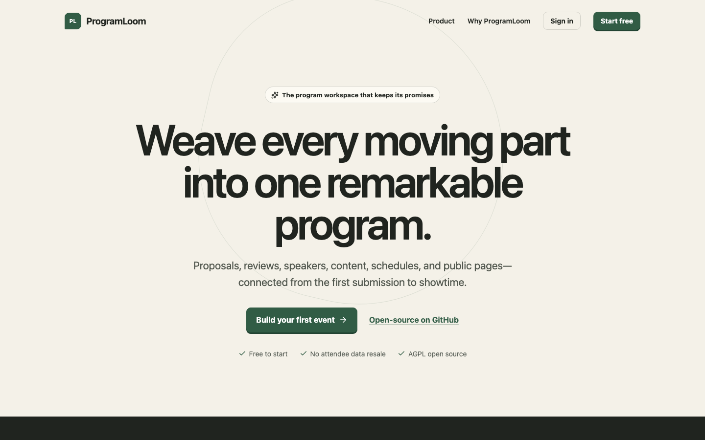

# ProgramLoom competition submission



## Submission fields

**Product:** ProgramLoom

**One-line description:** A free, open-source program operations workspace that carries an event from CFP through review, speakers, content, scheduling, and public publishing.

**Marketing site:** <https://programloom.com>

**Application:** <https://app.programloom.com>

**Source:** <https://github.com/maddiedreese/SaaS>

**License:** GNU AGPL-3.0-only

**Primary domain:** `programloom.com`

**Transactional sender:** `ProgramLoom <notifications@mail.programloom.com>`

## Short submission copy

ProgramLoom replaces the disconnected forms, spreadsheets, inbox threads, and schedule documents behind an event program. Organizers can publish conditional CFPs, run multi-round blind review, make and email decisions, onboard speakers, collect and version content, build a conflict-aware multi-day agenda, and publish five responsive attendee widgets. A cross-event speaker CRM, Airtable-authoritative mode, Workers AI assistance, PostHog analytics, Turnstile protection, and structured Cloudflare observability are included. The product is multi-tenant, mobile-accessible, fully persistent, free to use, and AGPL-3.0 open source.

## Judge-facing walkthrough

Run the product in this order so every handoff supplies the next module with real data:

1. **Organizer foundation:** Open the existing DevFlow Conf 2027 event in the DevFlow Programs workspace. Confirm its May 12–14 dates, America/Los_Angeles timezone, and Moscone West venue.
2. **CFP:** Add the three fixture tracks, build the fixture form with multiple field types and conditional workshop prerequisites, configure deadlines, and publish. Open its public URL signed out; validate required fields, save a draft, submit, and edit with the private token.
3. **Review and decisions:** Configure two independent blind-review rounds with weighted scorecards, invite/assign the reviewer, score as that reviewer, recuse where appropriate, inspect aggregates/export, and return as organizer. Queue and send a personalized decision. The accepted proposal becomes a session and speaker without re-entry.
4. **Speaker operations:** Accept the invite as the speaker. Update public profile and private logistics, complete tasks, read a sanitized resource, and upload headshot/slides. Return as organizer to review status, comments, versions, reminders, and approvals.
5. **Content:** Edit session/speaker content, inspect and restore history, exchange file comments, approve only final material, create an expiring share link, and download the latest-only grouped ZIP.
6. **Agenda:** Add rooms/tracks and non-session blocks. Place sessions by drag/drop or accessible selection, provoke both room and shared-speaker conflicts, use assisted scheduling, clear/move an item, and publish only after the program is complete and conflict-free.
7. **Public widgets:** Configure sessions, speakers, agenda, itinerary, and gallery widgets. Verify anonymous search/filter/details, live configuration propagation, device-persistent itinerary selection, JSON/XML/iCal feeds, and a calendar import.
8. **Speaker CRM:** Use the organization-level directory, import CSV/XLSX, map fields, search/filter, merge a duplicate, create a segment, move a sourced speaker through the eight-stage pipeline with notes/history, hand them into an event, publish an interest form, and inspect outreach and analytics.

## What is real

- D1 holds tenant identity, authorization, audits, and workflow state; R2 holds private files and generated archives; Queue handles durable integration work.
- Airtable-authoritative workspaces write through a durable outbox and HMAC webhook reconciliation to a dedicated ten-table base. Sync state, retries, and conflicts are visible to owners/admins.
- Resend sends transactional authentication, invitation, confirmation, decision, reminder, and outreach messages from the verified ProgramLoom domain.
- Workers AI produces review and content assistance with stored reasoning, original values, explicit human override/apply actions, and free-tier guards. Agenda assistance is deterministic and conflict-aware.
- PostHog uses explicit product events and identified-only profiles with no session recording or autocapture. Operational failures are structured JSON in Cloudflare Workers Observability.
- Turnstile protects anonymous write surfaces. Sessions, invitations, edit tokens, and share links are hashed, expiring, scoped, and revocable.

## Verification summary

- The exact upstream evaluator validates 7 areas, 20 ordered scenarios, and all 96 rubric items with optional scope included.
- Local and GitHub CI run the locked install, TypeScript checks, 29 automated tests, and production build.
- Repeatable local protocols exercise CRM and the two-role content/file lifecycle against Worker, D1, and R2—not mocks.
- Production probes verify health, headers, role isolation, Airtable round trips, authenticated boundaries, public boundaries, legal pages, and custom domains.
- Axe-core reports zero WCAG 2 A/AA/2.1 AA violations and zero horizontal overflow across twelve desktop/mobile production layouts.
- The current core application is 106.10 KB gzipped; heavier CRM, speaker, content, legal, and spreadsheet features load only when requested.

Full criterion-by-criterion implementation and evidence notes live in [evaluation-matrix.md](evaluation-matrix.md). Reproduction, deployment, recovery, and evaluator procedures live in [runbook.md](runbook.md).

## Architecture summary

```text
Browser / embedded widget
          |
          v
Cloudflare Worker + React assets
    |       |       |       |
    v       v       v       v
   D1      R2     Queue   Workers AI
    |               |
    +---- outbox ----+----> Airtable
    |
    +----> Resend email
    +----> structured Cloudflare logs

Browser ---- explicit product events ----> PostHog
```

## Scope decisions

- GitHub is the public source host because the competition Forge alpha was full.
- Accelevents integration is excluded because it requires paid access.
- Operational monitoring uses existing structured logs and Cloudflare Workers Observability; no third-party error collector is installed.
- No paid resource is enabled or consumed without the account owner’s explicit approval.

## Final-submission checklist

- [x] Production marketing and application domains
- [x] AGPL-3.0 source repository and CI
- [x] Official DevFlow Conf 2027 baseline and isolated personas
- [x] Airtable, Cloudflare, Resend, Turnstile, Workers AI, and PostHog configuration
- [x] Architecture, data model, Airtable, evaluation, security, and runbook documentation
- [x] Privacy and Terms pages
- [x] Free evaluator browser smoke and 96-rubric dry run
- [ ] Full paid ordered evaluator report
- [ ] Manual real-inbox, calendar, archive, and second-account evidence
- [ ] Finalized report and competition form submission
